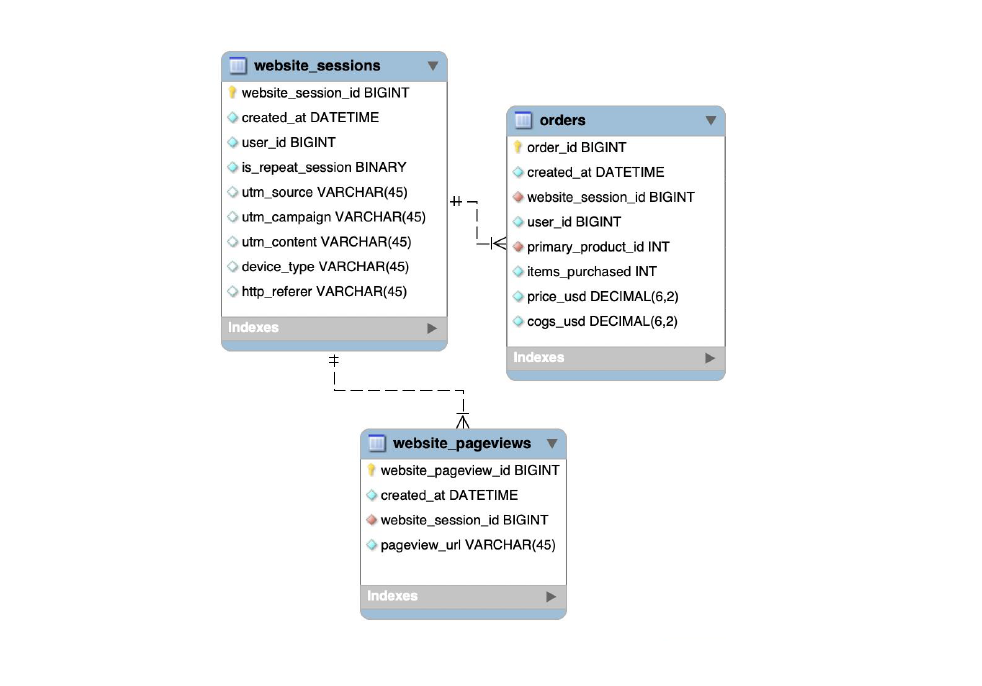

# Introduction
I'm an Ecommerce Database Analyst for an online retailer which has just launched their first product. I will analyze and optimize marketing channels, measure and test website conversion performance, and use data to understand the impact of changes to the website.

You can follow along using my Tableau Dashboard for this analysis here:<a href="https://public.tableau.com/profile/max53497276#!/"> Tableau Profile for Max Mellman</a>

# Dataset

The ecommerce dataset is from an online retailer using in-house server hosting for their website. They have multiple new products launched and I will derive insights into how well they're website is driving sales. My analysis drills down into the first year's performance.

I'll be working with three related tables containing nearly 1.7 million observations with 21 variables. The ecommerce dataset features information about the following:

•Website Activity 
•Products 
•Orders 

The tables and thier contents can be viewed below:

website_session_id: A unique identifier for each new session on the site. 
website_pageview_id: An incremental counter for each new view on the site per session. 
order_id: Each product sold is assigned a product identifier. 

# Tools

•PgAdmin 
•PostgreSQL 
•Tableau 

# Installation

1. Go to www.postgresql.org and click on the 'Downloads' Tab to download the appropriate version for your OS.
2. Run the installer for PostgreSQL leaving all the compenents checked and be sure to remember the password you create once prompted. (Uncheck 'Launch Stack Builder'.)
3. Go to www.pgadmin.org and click on the 'Downloads' Tab to download the latest version for your OS. Run the installer. Once complete, restart your computer.
4. Launch PgAdmin and when prompted to enter a password for your PostgreSQL version use the password created earlier.

Note: The upcoming steps involve downloading the CSV files located in this repository and importing them into PgAdmin. Currently, there is no automated way to import these files without first creating the tables for the data. The following instructions entail creating the tables first through a SQL Query then importing the CSV files into those tables.

1. Click on the Postgresql version downloaded (top right corner) and select 'Create'--> 'Database...' and name your database when prompted.
2. Click on the newly created database and select 'Query tool...' to create your table. The data for the tables and columns are provided from the link above.
3. Expand the newly created database icon, then expand the 'Schemas' tab, and lastly expand the 'public' schema to find your created tables from step 2.
4. Download the datasets from the repository and copy the file path. (This will be used as the 'filename' for your 'Import/Export' prompt in PgAdmin.)
5. Right click on your created table and select 'Import/Export...'.
6. Paste the copied filepath in the filename prompt. 
7. Uncheck 'header' as 'No' since no header is included in the CSV, and delimiter as ',' since its a CSV.
8. Click 'OK' to complete the import and repeat for the remaing tables.
